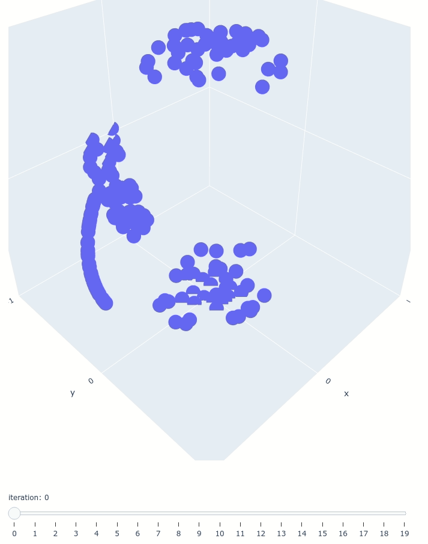

## spherical scatterplot relaxation

Some python code to "relax" points arranged on the surface of a sphere.

By "relaxing", we mean: to declutter a scatterplot by spacing the points that are very close to one another and filling the areas without any points.



**NB:** This works is heavily inspired by [sector-based-regularization](https://github.com/hennesrave/sector-based-regularization),
which propose a method to relax scatterplot in a 2D square (arguably a situation that concerns more people, but *I* wanted it on a sphere). Please give their [paper](https://ieeexplore.ieee.org/document/10771106) a read. 


### requirements

For the main relaxation script `spherical_scatterplot_relaxation.py`: numpy and pandas

For the plotting script : plotly and pandas 


### basic usage


simple usage:
`python spherical_scatterplot_relaxation.py -i test_data/test_input_data.csv -o test_data/test_output `

the results of this command can be vizualized with:

`python plot_spherical_relaxation.py -i test_data/test_output -a 1 -b 20 -o test_output.html`

Which generates an html file where you can slide through the rounds.


### arguments

`spherical_scatterplot_relaxation.py` arguments:

```
optional arguments:
  -h, --help            show this help message and exit
  -i INPUT_FILE, --input-file INPUT_FILE
                        input points file in csv format. 
                         * Expects 3 columns that should be named x, y, and z, and an index column. 
                         * The points are expected to be on the surface of a sphere centered on (0,0,0).
  -o OUTPUT_PREFIX, --output-prefix OUTPUT_PREFIX
                        output file prefix for the relaxed points. The output
                        file names will take the shape <output-prefix>_round<roundNumber>.csv
  -n NUMBER_ROUNDS, --number-rounds NUMBER_ROUNDS
                        number of relaxation rounds to play (default=20)
  -w WRITE_EVERY, --write-every WRITE_EVERY
                        frequency at which the relaxed points should be
                        written to a file; 0 means that only the result of the
                        last round will be written (default=1, meaning that it
                        writes to a file every round).
  -s NUMBER_SECTORS, --number-sectors NUMBER_SECTORS
                        number of sectors to consider around the points
                        (default=8). Higher values increase point movements
                        precision at a computational cost.
  -l LEARNING_RATE, --learning-rate LEARNING_RATE
                        Controls the rate at which positions are updated from
                        round to round. Lower values increase point movements
                        precision but more relaxation rounds may be needed.
                        Values should be in the interval (0,1].

```


`plot_spherical_relaxation.py` arguments:

```
usage: plot_spherical_relaxation.py [-h] -i INPUT_PREFIX -o OUTPUT_FILE [-a A]
                                    [-b B]

relaxes points plotted on a sphere

optional arguments:
  -h, --help            show this help message and exit
  -i INPUT_PREFIX, --input-prefix INPUT_PREFIX
                        input points prefix (the script will look for files
                        <input-prefix>_round<roundNumber>.csv). * Expects 3
                        columns that should be named x, y, and z, and an index
                        column.
  -o OUTPUT_FILE, --output-file OUTPUT_FILE
                        name of the html output file for the plot.
  -a A                  round to start plotting from.
  -b B                  round to plot to.

```

